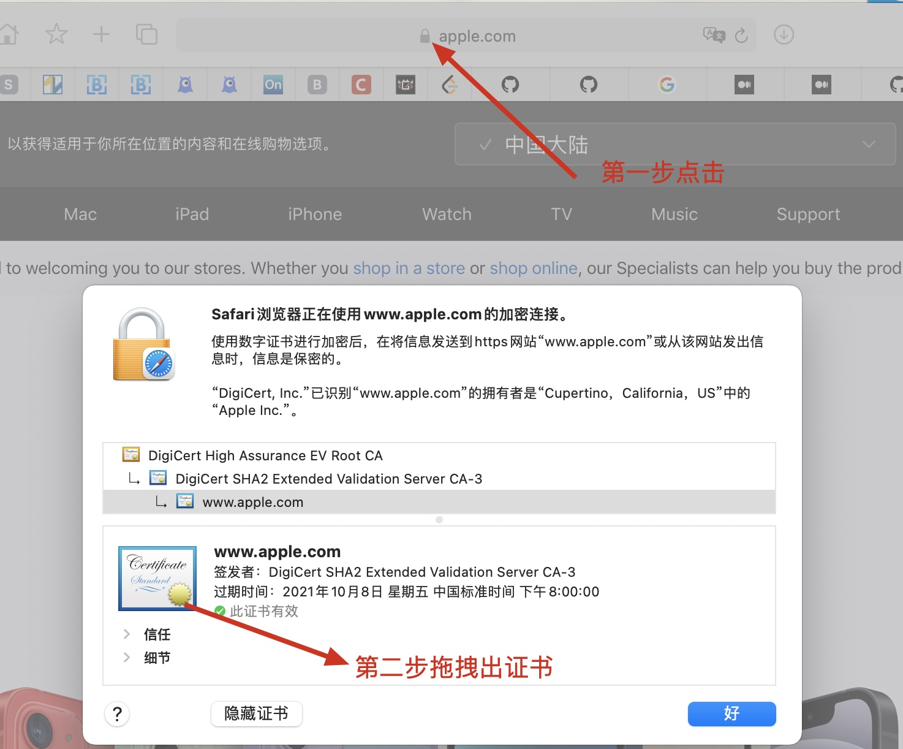

# 概述

SSL Pinning基于安全套接字层，SSL证书通过建立安全连接来构建信任基础

这种安全连接确保了**在web服务器和浏览器之间传递的所有数据保持私有和完整**。SSL证书有一对密钥，即**公钥和私钥**

这些密钥协同工作来建立加密连接。SSL证书包含"**Subject**"，用来**标识证书/网站所有者的身份**

SSL Pinning(SSL固定，简称固定)是将主机与其证书或公钥关联起来的过程，一旦知道了主机的**证书或公钥**，就将其固定到该主机上

> SSL Certificate Pinning, or pinning for short, is the process of associating a host with its certificate or public key. Once you know a host’s certificate or public key, you pin it to that host.

---

# 证书是什么? 它包含哪些其他信息？

证书是一个文件，它封装了关于拥有该证书的服务器的信息。它类似于身份证。证书结构采用**X.509**标准。**X.509**是由**国际电信联盟**的标准化部门定义的。证书由证书颁发机构(CA)颁发，也可以是自签名的

证书包含许多信息：

* **Subject**：提供CA向其颁发证书的实体(计算机、用户、网络设备等)的名称
* **Serial Number**：为CA颁发的每个证书提供唯一的标识符
* **Issuer**：颁发者，提供颁发证书的CA的唯一名称
* **Vaild From**：证书生效的日期和时间
* **Valid To**：证书失效的日期和时间
* **Public Key**：包含证书附带的密钥对的公钥
* **Algorithm Identifier**：证书签名时使用的算法
* **Digital Signature**：用于验证证书真实性的位字符串
* **Version**：证书的版本号
* **TimeStamp**：证书创建时间

数字证书(X.509)有几种常用的文件名扩展名：

* **PEM(Privacy Enhanced Mail)**：Base64编码，文件扩展名为.pem，证书信息包含在"**BEGIN CERTIFICATE**"和"**end certificate**"之间
* **PKCS(Public-key cryptography standards)**：公钥加密标准，用于在单个文件中交换公共和私有对象。它的扩展名有 **.p7b**，**.p7c**，**.p12**等等
* **DER(Distinguished Encoding Rules)**：二进制编码，文件扩展名为 **.cer**，**.der**和 **.crt**

---

# **为什么需要SSL Pinning?**

**SSL Pinning允许应用该程序只信任有效的或预定义(预置)的证书或公钥**。应用程序开发人员使用SSL Pinning技术作为应用程序流量的附加安全层。通常，应用程序信任自定义证书并允许应用程序拦截流量(抓包的意思)

通过Pinning来**限制可信证书集**，可以防止攻击者分析应用程序的功能及其与服务器通信的方式

---

# **SSL怎么工作?**

1. 客户端机器向服务器发送连接请求，服务器监听请求
2. 服务器给出响应，包括公钥和证书
3. 客户端检查证书并向服务器发送加密密钥
4. 服务器解密密钥并将加密的数据发送回客户端机器
5. 客户端接收并解密加密的数据

# SSL Pinning类型

* **Pin The certificate**：证书固定，你可以下载服务器的证书并把它放到你的应用程序中。在运行时，应用程序将服务器的证书与之前预先嵌入的证书进行比较
* **Pin the public key**：公钥固定，你可以检索服务器证书的公钥，并将其作为字符串包含在代码中。在运行时，应用程序将服务器证书的公钥与代码中的一个硬编码散列字符串进行比较

# iOS使用SSL Pinning

使用URLSeesion、AlamoFire、AFNetworking都可以实现证书固定和公钥固定，接下来使用URLSession来做一个简单的demo演示SSL Pinning

## 证书固定

1. 第一步，我们使用苹果的证书，从www.apple.com获取

   <div align="center">    
   
   </div>

2. 将证书命名为www.apple.com.der ，然后放到应用程序的bundle内

3. 接下来使用URLSeesion访问www.apple.com

   ```swift
   import UIKit
   
   class ViewController: UIViewController {
       
       override func viewDidLoad() {
           super.viewDidLoad()
           
           guard let url = URL(string: "https://www.apple.com") else {return}
           
           ServiceManager().callAPI(withURL: url, isCertificatePinning: false) { (message) in
               let alert = UIAlertController(title: "SSLPinning", message: message, preferredStyle: .alert)
               alert.addAction(UIAlertAction(title: "OK", style: .default, handler: nil))
               self.present(alert, animated: true, completion: nil)
           }
       }
   
   }
   ```

   ```swift
   private var isCertificatePinning: Bool = false
   
   func callAPI(withURL url: URL, isCertificatePinning: Bool, completion: @escaping (String) -> Void) {
       let session = URLSession(configuration: .ephemeral, delegate: self, delegateQueue: nil)
       self.isCertificatePinning = isCertificatePinning
       var responseMessage = ""
       let task = session.dataTask(with: url) { (data, response, error) in
           if error != nil {
               print("error: \(error!.localizedDescription): \(error!)")
               responseMessage = "Pinning failed"
           } else if data != nil {
               let str = String(decoding: data!, as: UTF8.self)
               print("Received data:\n\(str)")
               if isCertificatePinning {
                   responseMessage = "Certificate pinning is successfully completed"
               }else {
                   responseMessage = "Public key pinning is successfully completed"
               }
           }
           
           DispatchQueue.main.async {
               completion(responseMessage)
           }
           
       }
       task.resume()
   }
   ```

4. 在URLSession delegate方法**URLAuthenticationChallenge**中会返回服务器远程证书给我们，接下来就可以做校验工作，我们将从服务器接收到的服务器证书转换为Data格式。类似地，我们将应用中的证书转换为Data格式，并匹配两者(服务器证书和本地证书)

   ```swift
   // 取出服务器证书
   let certificate = SecTrustGetCertificateAtIndex(serverTrust, 0)
   
   // SSL Policies for domain name check
   // SSL 验证策略 验证服务器域名是否匹配
   let policy = NSMutableArray()
   policy.add(SecPolicyCreateSSL(true, challenge.protectionSpace.host as CFString))
   
   // evaluate server certifiacte
   // 评估服务器证书(服务器证书是否受信任的?)
   let isServerTrusted = SecTrustEvaluateWithError(serverTrust, nil)
   
   // Local and Remote certificate Data
   // 服务器证书二进制
   let remoteCertificateData:NSData =  SecCertificateCopyData(certificate!)
   // let LocalCertificate = Bundle.main.path(forResource: "github.com", ofType: "cer")
   let pathToCertificate = Bundle.main.path(forResource: "www.apple.com", ofType: "cer")
   // 本地预置服务器证书二进制
   let localCertificateData:NSData = NSData(contentsOfFile: pathToCertificate!)!
   
   // Compare certificates
   // 证书比较
   if(isServerTrusted && remoteCertificateData.isEqual(to: localCertificateData as Data)){
     let credential:URLCredential =  URLCredential(trust:serverTrust)
     print("Certificate pinning is successfully completed")
     completionHandler(.useCredential,credential)
   }
   else{
     completionHandler(.cancelAuthenticationChallenge,nil)
   }
   ```

## 公钥固定

由于证书会有限期，所以在将来某个时候，要更换服务器证书和客户端预置证书。为了解决这个问题，可以使用公钥固定，因为公钥在证书过期后，还能继续以该公钥向CA申请证书。因此用公钥做固定更长久有效，更加灵活

1. 如何获取证书中的公钥?

   ```shell
   openssl s_client -connect the.host.name:443 | openssl x509 -pubkey -noout
   ```

   此处我们的例子为

   ```shell
   openssl s_client -connect www.apple.com:443 | openssl x509 -pubkey -noout
   ```

   ```
   depth=2 C = US, O = DigiCert Inc, OU = www.digicert.com, CN = DigiCert High Assurance EV Root CA
   verify return:1
   depth=1 C = US, O = "DigiCert, Inc.", OU = www.digicert.com, CN = DigiCert SHA2 Extended Validation Server CA-3
   verify return:1
   depth=0 businessCategory = Private Organization, jurisdictionCountryName = US, jurisdictionStateOrProvinceName = California, serialNumber = C0806592, C = US, ST = California, L = Cupertino, O = Apple Inc., CN = www.apple.com
   verify return:1
   -----BEGIN PUBLIC KEY-----
   MIIBIjANBgkqhkiG9w0BAQEFAAOCAQ8AMIIBCgKCAQEAyhscIXgVPUDPo3k/nc+y
   U6upQf8+BqEpaYoERp77xA1WesrmgOevxsC/i2BxyprodgwGyJt3uPMb6n7nOoTL
   o4ilkwQ/aWZ3z64G0dnhEAh64CSY51aXD3Noe01pRigm/wWBDMDa/CFxgWWaOcnp
   aDY2Al+BgLd+ilv+NNDOdi3Ziz7UE8Ds6w8sd60eeyD22pKY/Ynzp8tTFi6wuWK+
   yMMoQM+MXGF3j5I9LyPyCqtlgiK4mM66yACV5Gc0bnbl0dMtUZG878DI3vh7zEZF
   AHbZyzAx6Vb9Dmj0NvkbX4hhYo9gqN5De1zBFXPUBhJuhZtQnCS/X/z0aJVn1b9E
   cQIDAQAB
   -----END PUBLIC KEY-----
   ```

   上面的**-----BEGIN PUBLIC KEY-----**和**-----END PUBLIC KEY-----**之间的内容就是苹果证书的公钥

2. 生成hashkey

   可以通过该网站https://www.ssllabs.com/ssltest/查询，或者使用openssl命令

   ```shell
   openssl s_client -servername www.apple.com -connect www.apple.com:443 | openssl x509 -pubkey -noout | openssl pkey -pubin -outform der | openssl dgst -sha256 -binary | openssl enc -base64
   ```

   输出的结果(**SHA256**)如下

   ```
   fO01cKyxWgDxqMQ4Q3EERIecCyqmlOQheFVlJkTvnNk=
   ```

3. 嵌入代码

   ```swift
   static let publicKeyHash = "fO01cKyxWgDxqMQ4Q3EERIecCyqmlOQheFVlJkTvnNk="
           
   let rsa2048Asn1Header:[UInt8] = [
       0x30, 0x82, 0x01, 0x22, 0x30, 0x0d, 0x06, 0x09, 0x2a, 0x86, 0x48, 0x86,
       0xf7, 0x0d, 0x01, 0x01, 0x01, 0x05, 0x00, 0x03, 0x82, 0x01, 0x0f, 0x00
   ]
   
   private func sha256(data : Data) -> String {
       var keyWithHeader = Data(rsa2048Asn1Header)
       keyWithHeader.append(data)
       var hash = [UInt8](repeating: 0,  count: Int(CC_SHA256_DIGEST_LENGTH))
   
       keyWithHeader.withUnsafeBytes {
         _ = CC_SHA256($0, CC_LONG(keyWithHeader.count), &hash)
       }
   
       return Data(hash).base64EncodedString()
   }
   ```

   ```swift
   if let serverCertificate = SecTrustGetCertificateAtIndex(serverTrust, 0) {
       // 取出服务器公钥
       let serverPublicKey = SecCertificateCopyKey(serverCertificate)
       // 服务器公钥data格式
       let serverPublicKeyData = SecKeyCopyExternalRepresentation(serverPublicKey!, nil )!
       let data:Data = serverPublicKeyData as Data
       // 服务器公钥的hash
       let serverHashKey = sha256(data: data)
       // 本地证书公钥的hash
       let publickKeyLocal = type(of: self).publicKeyHash
       // hash比对
       if (serverHashKey == publickKeyLocal) {
           // 验证成功，请求的服务器是自家的
           print("Public key pinning is successfully completed")
           completionHandler(.useCredential, URLCredential(trust:serverTrust))
           return
       } else {
           print("Public key pinning failed")
           completionHandler(.cancelAuthenticationChallenge, nil)
           return
       }
   }
   ```

   # Ref

   [Everything you need to know about SSL Pinning](https://medium.com/flawless-app-stories/ssl-pinning-254fa8ca2109)

